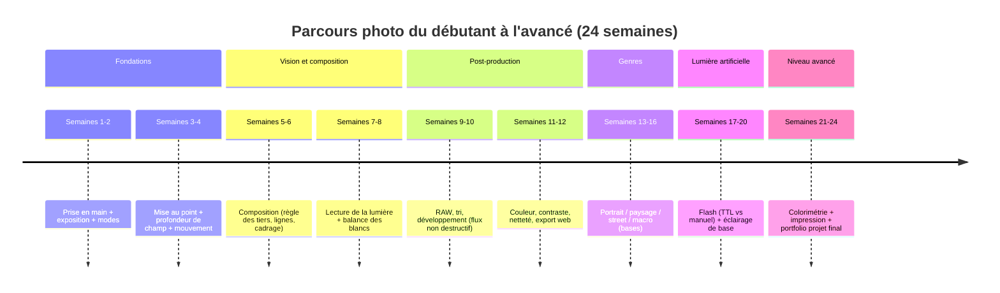

# Créer un site portfolio avec blog intégré pour enseigner la photographie

## Synthèse exécutive

Ce rapport propose une approche « site + pédagogie + SEO » pensée pour un public général (débutant → amateur éclairé) et pour un positionnement d’enseignant·e en photographie (crédibilité, clarté, progression, preuves de compétence). La ligne directrice est de bâtir un **parcours d’apprentissage structuré** (pages “cours” pérennes) et de l’alimenter par un **blog en grappes thématiques** (articles ciblant des intentions de recherche), tout en veillant à la performance et à l’accessibilité — critiques pour un site très imagé. Les recommandations SEO s’appuient sur la documentation officielle de entity["company","Google","search and ads company"] (Search Essentials, titres, contenu utile, SEO des images, données structurées, Core Web Vitals).citeturn10search1turn10search3turn10search5turn2search0turn0search3

Sur le plan pédagogique, le curriculum est conçu selon une logique d’**alignement** entre objectifs, activités et évaluations (constructive alignment) et selon une progression cognitive (taxonomie de Bloom / révision), complétée par des méthodes d’apprentissage robustes : **charge cognitive**, **récupération active (testing effect)** et **espacement**, et **pratique délibérée**.citeturn4search0turn4search5turn4search6turn3search1turn3search23turn3search9turn3search38

Enfin, le rapport fournit **15 outlines SEO + brouillons complets en français**, chacun avec : mots-clés, meta title/description, structure Hn, images/diagrammes conseillés (avec légendes), liens internes, longueur estimée et CTA. Les brouillons sont **originaux** (rédaction neuve) ; les concepts techniques (exposition, histogramme, balance des blancs, RAW/JPEG, etc.) sont étayés par des sources officielles, en particulier les ressources entity["company","Nikon","camera and optics company"], entity["company","Canon","camera and imaging company"], entity["company","Adobe","software company"] et des standards (ICC, IEC, WCAG, textes juridiques français).citeturn1search1turn1search5turn5search13turn7search0turn7search1turn2search3turn15search4turn15search1

## Architecture du site et stratégie éditoriale

### Modèle “cours pérennes + blog” pour une progression lisible

La structure la plus efficace pour enseigner (et pour le SEO) est un modèle hybride :
- des **pages “cours”** (piliers) stables et complètes, organisées en modules (ex. : Exposition, Composition, Lumière, Post-production), qui constituent la référence interne ;
- des **articles de blog** plus “ciblés” (questions fréquentes, erreurs courantes, cas d’usage, checklists) qui renvoient systématiquement vers les pages “cours” et entre eux (maillage interne). Ce modèle soutient la logique “helpful / people-first content” recommandée par Google : priorité à l’utilité et à l’expérience, plutôt qu’au contenu “search engine-first”.citeturn10search5turn10search1turn0search0

Pour renforcer la crédibilité (E‑E‑A‑T), il faut afficher clairement : qui enseigne, avec quelle expérience, comment le contenu est produit et mis à jour, ainsi que des informations de contact et de politique éditoriale. Google décrit E‑E‑A‑T comme un cadre d’évaluation de qualité (quality raters) et recommande d’en tenir compte pour auto-évaluer la fiabilité et l’utilité du contenu.citeturn10search0turn10search5turn10search12

### Architecture recommandée des pages

Tableau d’architecture minimaliste (facile à naviguer, facile à mailler, alignée avec un site “portfolio + enseignement”) :

| Page | Rôle pédagogique | Rôle SEO | Éléments clés (contenu + UX) |
|---|---|---|---|
| Accueil | Promesse, niveau, méthode | Page de marque + navigation | Présentation, “commencer ici”, modules, derniers articles, preuves (témoignages) |
| Portfolio | Montrer la maîtrise | Autorité + intention “photographe + style” | Projets/cas, contexte, choix techniques, avant/après (si retouche), liens vers leçons |
| Parcours d’apprentissage | Donner un chemin clair | Page “hub” | Timeline, niveaux, prérequis, auto-diagnostic |
| Cours (piliers) | Enseigner “en profondeur” | Pages evergreen | Objectifs, leçon, exercices, checklist, quiz, ressources, CTA |
| Blog | Répondre à des questions | Acquisition organique | Catégories “cluster”, articles reliés, FAQ |
| Ressources | Curations + bibliographie | Longue traîne + confiance | Sélections commentées (FR/EN), outils, glossaire |
| À propos / Méthode | E‑E‑A‑T | Confiance | Bio, matériel, workflow, valeurs, politique de mise à jour |
| Contact | Conversion | Navigation | Formulaire, briefing, newsletter, réseaux |

Les pages “cours” et “blog” gagnent à suivre des *templates* homogènes (même structure Hn, mêmes blocs “objectif / exercice / erreurs fréquentes”), ce qui réduit la charge cognitive de lecture et facilite l’indexation.citeturn3search1turn4search6turn10search1

### Performance, SEO des images, accessibilité

Un site photo est un site “image-first” ; il faut donc traiter images et performance comme des exigences de base :
- Google recommande des **noms de fichiers descriptifs, du texte alternatif pertinent, des légendes proches du texte**, et l’ajout de métadonnées/données structurées quand pertinent.citeturn2search0turn2search1  
- Les **Core Web Vitals** (expérience réelle : chargement, interactivité, stabilité visuelle) sont explicitement recommandés pour une bonne expérience et une meilleure performance SEO.citeturn0search3  
- Si vous utilisez entity["organization","WordPress","open-source cms"], le support d’images responsives via `srcset`/`sizes` est natif depuis longtemps et doit être conservé (thèmes compatibles, tailles générées).citeturn2search2  
- Accessibilité : WCAG 2.2 insiste sur les équivalents textuels (text alternatives) et le WAI détaille comment choisir un alt text selon l’objectif de l’image (informative vs décorative).citeturn2search3turn2search11

**Où utiliser des diagrammes / graphiques sur le site (fort impact pédagogique)**  
- Diagramme “triangle d’exposition” et tableau de scénarios (intérieur sombre / sport / portrait).citeturn1search1turn1search19  
- Histogramme annoté (luminance + RGB) pour relier exposition ↔ données.citeturn6search3turn6search1  
- Graphique “distance à la source ↔ intensité” (loi en 1/r²) pour la lumière artificielle (flash/LED).citeturn9search0turn9search2  
- Schéma “workflow RAW” (import → tri → develop → export → sauvegarde), relié aux outils.citeturn0search8turn0search12  
- Schéma de colorimétrie (sRGB vs Adobe RGB, profils ICC, impression).citeturn7search1turn7search6turn7search28turn6search5

## Curriculum complet d’apprentissage de la photographie

### Logique pédagogique et critères de progression

Le parcours est conçu pour passer de la **connaissance déclarative** (“je sais ce qu’est l’ISO”) à la **compétence procédurale** (“je choisis ISO/vitesse/ouverture en situation”) puis à la **création** (projets cohérents, style, narration), conformément à une progression de type Bloom (révisée).citeturn4search0turn4search5  
Chaque module aligne : objectifs → activités (shooting drills, études de cas) → évaluations (quiz, photos à produire) (“constructive alignment”).citeturn4search6  
Les exercices exploitent aussi :
- la **répétition espacée** (meilleure rétention quand l’apprentissage est distribué)citeturn3search9turn3search2  
- la **récupération active** (quiz, auto-tests)citeturn3search23turn3search4  
- la **pratique délibérée** (drills ciblés + feedback rapide).citeturn3search38turn3search14

### Timeline d’apprentissage recommandée

### Modules et leçons détaillés

Chaque leçon inclut : **objectif**, **prérequis**, **temps estimé**, **exercices**, **livrable**.

#### Module Fondations techniques

| Leçon | Objectif (mesurable) | Prérequis | Temps estimé | Exercices (suggestion) | Livrable |
|---|---|---:|---:|---|---|
| Prise en main boîtier/smartphone | Régler mode P/A/Av/S/Tv/M, activer grille, RAW/JPEG | Aucun | 2h | “Menu tour” + 30 photos test intérieur/extérieur | Check-list réglages perso |
| Triangle d’exposition | Expliquer l’impact ouverture/vitesse/ISO et obtenir 3 expositions correctes | Prise en main | 3h | Série “même scène, 9 variantes” + notes | Planche contact + notes | 
| Modes d’exposition | Choisir le mode adapté à 5 situations | Triangle | 2h | Scènes (sport, portrait, nuit…) + justification | Tableau décisions |
| ISO et bruit | Minimiser le bruit à exposition correcte (sans flou) | Triangle | 2h | Série ISO 100→6400, analyse | Mini-rapport bruit |

Ce module s’appuie sur des explications techniques cohérentes avec celles proposées par Nikon/Canon (triangle : ouverture, vitesse, ISO ; modes P/Av/Tv/M) et sur une définition opérationnelle de l’ISO (sensibilité/“gain” et bruit).citeturn1search1turn1search19turn1search18turn0search10

#### Module Netteté, mise au point et profondeur de champ

| Leçon | Objectif (mesurable) | Prérequis | Temps estimé | Exercices | Livrable |
|---|---|---:|---:|---|---|
| Autofocus et zone AF | Obtenir 20/20 images nettes sur sujet immobile | Fondations | 2h | Sujet statique, différents collimateurs | Série “net/moins net” commentée |
| Mouvement et vitesse | Choisir une vitesse pour figer vs filé | Fondations | 3h | Sport léger : 1/1000, 1/250, 1/60 filé | Triptyque figer/filé/raté |
| Profondeur de champ | Contrôler flou arrière-plan (portrait) et nettet é front-to-back (paysage) | Fondations | 3h | f/1.8 à f/16 + distance sujet | Comparatif annoté |
| Stabilisation/trépied | Réussir 10 poses longues nettes | Mouvement | 2h | Nuit : 1s→15s | Série “pose longue” |

La profondeur de champ (impact de l’ouverture et compromis vitesse) est explicitement décrite dans les ressources Canon destinées aux photographes (infobank + manuels).citeturn1search11turn1search23turn1search2

#### Module Composition et lecture d’image

| Leçon | Objectif (mesurable) | Prérequis | Temps estimé | Exercices | Livrable |
|---|---|---:|---:|---|---|
| Règle des tiers | Composer 15 images en utilisant la grille sans rigidité | Fondations | 2h | “Défi 15 cadres” (portrait, rue, paysage) | Sélection 6 + analyse |
| Lignes directrices & cadrage | Créer des parcours visuels (œil guidé) | Règle des tiers | 3h | Architecture/rue, recherche de lignes | Triptyque avant/après |
| Espace négatif & minimalisme | Simplifier une scène en 3 versions | Composition | 2h | Même sujet, 3 cadrages | Contact sheet |
| Critique et auto-critique | Écrire une critique courte (intention, réussite, axe) | Composition | 2h | Grille d’analyse | 1 page / série |

Nikon et Canon décrivent explicitement la règle des tiers et des techniques de composition (lignes directrices, espace négatif…) comme des outils pour organiser le regard et équilibrer l’image — utiles pour un enseignement structuré.citeturn5search0turn5search5

#### Module Couleur, balance des blancs, exposition avancée

| Leçon | Objectif | Prérequis | Temps | Exercices | Livrable |
|---|---|---:|---:|---|---|
| Balance des blancs | Obtenir des couleurs cohérentes (intérieur/extérieur) | Fondations | 2h | Série sous tungstène / LED / jour, WB auto vs manuel | Comparatif + notes |
| Histogramme | Diagnostiquer surex/sous-exposition + clippings | Triangle | 3h | Exposer une scène contrastée en utilisant histogramme | 6 images + analyse |
| Mesure de lumière & compensation | Utiliser compensation d’expo sur scène difficile | Histogramme | 2h | Scènes neige/contre-jour | Série + réglages |
| Basse lumière | Limiter flou + bruit par choix triade | ISO/bruit | 3h | “Sans flash” intérieur: 3 solutions | Mini étude de cas |

Canon et Nikon documentent la balance des blancs, l’histogramme (luminance et RGB) et l’usage des modes/compensations comme outils de contrôle.citeturn1search5turn6search3turn6search1turn6search25turn1search19

#### Module Post-production et workflow RAW

| Leçon | Objectif | Prérequis | Temps | Exercices | Livrable |
|---|---|---:|---:|---|---|
| RAW vs JPEG | Choisir format selon usage (web/print/urgence) | Fondations | 2h | Même scène en RAW+JPEG, edit léger | Comparatif exports |
| Développement non destructif | Corriger exposition/WB/tonalité proprement | RAW vs JPEG | 4h | 20 photos, corrections basiques | Preset + exports |
| Couleur et tonalité | Ajuster contraste/courbe sans artefacts | Dév. | 3h | 10 photos difficiles (contre-jour) | Avant/après commenté |
| Export web | Exporter optimisé (taille, profil, netteté) | Dév. | 2h | 3 tailles (web, IG, print) | Pack exports |

La différence RAW/JPEG (latitude de retouche) est expliquée clairement par Nikon et Adobe, et les outils de base de développement (WB, tonalité) sont documentés dans l’aide officielle d’Adobe Lightroom Classic.citeturn5search6turn5search13turn0search8turn0search12

#### Module Lumière artificielle et flash

| Leçon | Objectif | Prérequis | Temps | Exercices | Livrable |
|---|---|---:|---:|---|---|
| Principes lumière (distance) | Expliquer 1/r² et anticiper chute de lumière | Fondations | 2h | Démo LED/lampe : 0,5m/1m/2m | Graphique + photos |
| Flash TTL vs manuel | Réussir 10 portraits indoor cohérents | Lumière | 4h | TTL puis manuel, comparaison | Série + réglages |
| Nombre-guide | Calculer ouverture/distance à partir GN | Flash | 2h | Exercices GN sur 5 distances | Tableau calculs |
| Éclairage simple (key/fill) | Créer 2 ambiances avec 1 flash+réflecteur | Flash | 4h | Setup “douceur” / “dramatique” | Avant/après |

La loi d’inverse du carré (illuminance) est expliquée dans des ressources de physique ouvertes (OpenStax) et des publications de métrologie (NIST), et l’usage du nombre-guide est documenté par Canon (formule GN = f‑stop × distance).citeturn9search0turn9search2turn9search3turn8search29

#### Module Avancé : colorimétrie, impression, portfolio

| Leçon | Objectif | Prérequis | Temps | Exercices | Livrable |
|---|---|---:|---:|---|---|
| Profils ICC & espaces couleur | Choisir sRGB/Adobe RGB selon sortie | Dév. | 3h | Export sRGB vs Adobe RGB + comparaison | Note technique |
| Soft proof & impression | Préparer un tirage cohérent (profil papier) | ICC | 4h | Soft proof, correction, print test | Tirage + fiche |
| Portfolio pédagogique | Construire 3 séries “enseignables” | Tous modules | 6h | Sélection, éditing, texte | Portfolio v1 |
| Projet final | Produire un mini-projet documenté (process) | Tous modules | 8–12h | De l’intention au rendu | Dossier projet |

Standards et ressources : rôle des profils ICC (ICC + Adobe ICC), standard sRGB (IEC), spécification Adobe RGB, et gestion colorimétrique à l’impression (documentation DxO PhotoLab).citeturn7search0turn7search28turn7search1turn7search6turn6search5

## Méthodes pédagogiques et compétences pour enseigner la photo

### Concevoir un enseignement “expert” : alignement, objectifs et évaluation

Un enseignement efficace commence par des objectifs observables, allant du “se souvenir/comprendre” au “créer” (Bloom et révision). Cela permet d’éviter le piège fréquent en photo : “faire sans savoir pourquoi”.citeturn4search0turn4search5  
Ensuite, l’alignement constructif (Biggs) exige que les activités (shooting drills, analyses, critiques) et les évaluations (quiz, séries à produire) mesurent réellement ces objectifs.citeturn4search6

**Application concrète à la photo**  
- Objectif “comprendre” : expliquer le triangle d’exposition.  
- Objectif “appliquer” : régler l’exposition en 5 situations.  
- Objectif “analyser” : diagnostiquer une image ratée (flou, bruit, WB).  
- Objectif “créer” : projet cohérent (série + narratif + choix techniques).citeturn4search5turn4search6turn1search1turn6search3

### Réduire les blocages des débutants : charge cognitive et scaffolding

La théorie de la charge cognitive met en garde contre des tâches trop “ouvertes” trop tôt : chez les novices, la résolution de problèmes peut consommer les ressources mentales au détriment de l’apprentissage de schémas (schemas). D’où l’importance de **progressions**, d’exemples travaillés et de checklists.citeturn3search1turn3search8  
En photographie, cela justifie : (a) des drills très cadrés (ex. même scène, variations ISO/vitesse/ouverture), puis (b) des exercices plus libres une fois les automatismes acquis.citeturn1search1turn6search3

### Méthodes d’apprentissage à fort rendement

- **Récupération active (testing effect)** : faire des quiz (ex. “quelle vitesse minimale pour figer un enfant ?”, “où regarder sur l’histogramme ?”) améliore la rétention et le transfert, plutôt que relire passivement.citeturn3search23turn3search4  
- **Espacement** : distribuer les séances (ex. 2×45 min/semaine) est plus robuste qu’un bloc unique (effet de pratique distribuée).citeturn3search9turn3search2  
- **Pratique délibérée** : cibler une compétence (ex. mise au point), augmenter la difficulté et obtenir un feedback rapide. Les travaux sur l’expertise insistent sur l’importance d’efforts prolongés et orientés amélioration.citeturn3search38turn3search14  
- **Apprentissage expérientiel** : cycles “expérience → réflexion → conceptualisation → expérimentation” utiles pour concevoir des ateliers (shoot + critique + re-shoot).citeturn4search3turn4search11

### Compétences clés de l’enseignant·e photo

1) **Diagnostiquer** un problème (exposition, mouvement, WB, composition) à partir d’une image et de ses métadonnées (EXIF). Les outils comme l’histogramme (luminance/RGB) sont centraux pour objectiver les retours.citeturn6search3turn6search1  
2) **Donner du feedback actionnable** : “1 point fort / 1 axe / 1 exercice” (micro-boucles). Cette approche est cohérente avec la pratique délibérée (petites améliorations ciblées).citeturn3search38  
3) **Rendre visible la décision** : expliquer “pourquoi j’ai choisi Av + ISO auto” ou “pourquoi WB manuel en intérieur”, afin de transformer une recette en modèle mental.citeturn1search19turn1search5turn0search15  
4) **Savoir enseigner la post-production** comme une continuité de la prise de vue (non destructif, cohérence WB/couleur/tonalité), en s’appuyant sur une documentation fiable des outils.citeturn0search8turn0search12

### Erreurs et idées fausses fréquentes à corriger

- “Le triangle d’exposition est une règle” : c’est un modèle pour équilibrer exposition et intention (mouvement/profondeur de champ/bruit).citeturn1search1turn1search19  
- “La règle des tiers s’applique partout” : Nikon/Canon la présentent comme un outil, pas une obligation, et la composition peut “briser les règles” une fois comprises.citeturn5search0turn5search5  
- “L’histogramme doit être ‘centré’ ” : la forme dépend de la scène ; l’enjeu est surtout d’éviter les pertes irréversibles (clipping) selon l’intention.citeturn6search3turn6search1  
- “RAW = mieux” : RAW donne plus de latitude, mais le flux et le besoin (rapidité, volume, diffusion) déterminent le choix.citeturn5search6turn5search13  
- “Le flash = lumière dure” : la dureté dépend surtout de la taille apparente de la source et de la diffusion (modifier la lumière est un apprentissage). Les bases flash (nombre-guide, puissance) sont documentées côté fabricants.citeturn8search29turn9search3

## Ressources francophones et anglophones comparées

### Institutions, formations et communautés

- entity["organization","École nationale supérieure de la photographie","arles, france"] : école publique centrée sur la photographie, avec cursus (master/doctorat) et programmation.citeturn1search0turn1search4turn1search32  
- entity["organization","Spéos","photography school paris, france"] : programmes pro (fondamentaux, photojournalisme, documentaire, etc.) et partenariats (AFP, Magnum…) décrits sur le site de l’école.citeturn11search2turn11search14  
- entity["organization","Union des Photographes Professionnels","photographers association france"] : accompagnement et défense des photographes, ressources juridiques et professionnelles.citeturn11search4turn15search13  
- entity["organization","Fédération Photographique de France","photo federation france"] : réseau de photo-clubs et compétitions, utile pour apprentissage par projets/retours.citeturn11search5  
- entity["organization","FUN-MOOC","french mooc platform"] : plateforme nationale de cours en ligne (utile pour contenus connexes : image numérique, vidéo, etc.).citeturn11search3turn11search19  
- entity["organization","International Center of Photography","photography institution new york, us"] : offre de cours et ateliers, présentée comme centre global d’éducation photo.citeturn12search0turn12search3  
- entity["organization","The Royal Photographic Society","photographic society uk"] : qualifications et cours en ligne, avec système de distinctions et ateliers.citeturn12search4turn12search12  
- entity["organization","Magnum Photos","photo agency cooperative"] : offre d’apprentissage en ligne et ateliers (“Magnum Learn”), centrée narration/édition.citeturn12search1turn12search20

### Ouvrages et auteurs de référence

Pour une sélection “enseignement” (pas seulement inspiration), privilégier des ouvrages qui expliquent **processus + décisions + exercices**.

- entity["book","La chambre claire","roland barthes 1980"] – entity["people","Roland Barthes","french literary theorist"] : référence critique pour enseigner vocabulaire, punctum/studium, lecture d’image.citeturn14search0  
- entity["book","Sur la photographie","susan sontag french edition"] – entity["people","Susan Sontag","american writer"] : utile pour penser éthique, société, intention documentaire.citeturn14search1turn14search26  
- entity["book","Images à la sauvette","henri cartier-bresson 1952"] – entity["people","Henri Cartier-Bresson","french photographer"] : point d’appui pour composition, instant décisif, éditing (bio/biblio).citeturn14search10  
- entity["book","Understanding Exposure","bryan peterson amphoto"] – entity["people","Bryan Peterson","photography instructor"] : très pédagogique sur exposition et décisions (éditeur Amphoto / PRH).citeturn13search21turn13search18  
- entity["book","Light — Science & Magic","hunter biver fuqua routledge"] – entity["people","Fil Hunter","photography educator"] : cadre théorique robuste pour enseigner l’éclairage (éditeur Routledge).citeturn13search7turn13search25  
- entity["book","The Photographer's Eye","michael freeman ilex"] – entity["people","Michael Freeman","photography author"] : approche systématique de composition/design (éditeur).citeturn13search5turn13search23  
- entity["book","Les Américains","robert frank delpire 1958"] – entity["people","Robert Frank","photographer swiss-american"] : référence d’édition et de narration visuelle (notice BnF).citeturn14search3  

### Sites et documents techniques “autorité” (FR/EN)

Tableau utile pour construire votre page “Ressources” (commentée) :

| Ressource | Langue | Type | Niveau | Pourquoi c’est pertinent pour enseigner |
|---|---|---|---|---|
| Nikon Learn & Explore (triangle, histogramme, composition, ISO) | FR | Docs marque | Débutant→intermédiaire | Explications structurées + terminologie standard (base de cours)citeturn1search1turn6search3turn5search0turn0search10 |
| Canon Get Inspired / Infobank (WB, DOF, histogrammes, flash) | FR/EN | Docs marque | Débutant→avancé | Articles techniques + notions pro (flash GN, histogrammes)citeturn1search5turn1search11turn6search1turn8search29 |
| Adobe HelpX (Lightroom développement, tonalité/couleur) | FR/EN | Doc logiciel | Tous | Référence “qu’est-ce que fait l’outil” (fiable)citeturn0search8turn0search12 |
| ICC + standards sRGB/Adobe RGB | EN | Standard | Avancé | Pour enseigner colorimétrie sans approximationsciteturn7search28turn7search1turn7search6 |
| W3C WCAG + WAI Images tutorial | EN | Standard | Tous | Accessibilité : alt text correct et images informatives/décorativesciteturn2search3turn2search11 |
| Docs SEO Google (Search Essentials, Images, Article schema, titres) | EN | Doc moteur | Tous | Fondations SEO “officiel” (site très image)citeturn10search1turn2search0turn2search1turn10search3 |

### Note sur l’originalité et l’usage des sources

Les sources ci-dessus servent à **valider** les concepts (définitions, standards, règles juridiques), pas à être copiées. Les brouillons fournis plus bas sont rédigés **ex novo** ; pour publier, vous pouvez ajouter vos propres exemples, photos, schémas faits maison, et retours d’expérience (ce que Google associe à “Experience” dans E‑E‑A‑T).citeturn10search0turn10search5turn10search12

## Plan SEO et articles prêts à publier

### Stratégie de contenu

**Piliers (pages cours)** : exposition, composition, lumière, post-production, colorimétrie, portfolio.  
**Clusters (blog)** : chaque article traite une question précise (intention informationnelle), renvoie au pilier et à 2–4 articles voisins. Cette logique renforce la compréhension du sujet par les lecteurs et clarifie les relations thématiques pour l’indexation (Google met en avant l’importance d’un contenu utile, structuré, et d’une bonne expérience de page).citeturn10search5turn0search0turn10search1turn0search3

### Articles en français avec outlines SEO et brouillons complets

#### Triangle d’exposition

**Mots-clés**  
- Principal : triangle d’exposition  
- Secondaires : ouverture vitesse obturation ISO, mode manuel photo, exposition photo débutant  

**SEO**  
- Meta title : Triangle d’exposition : ouverture, vitesse, ISO (guide)  
- Meta description : Comprenez le triangle d’exposition et réglez ouverture, vitesse et ISO sans deviner. Exemples + exercices pour débuter sereinement.  
- Slug : `/blog/triangle-exposition`

**Structure**  
- H1 : Triangle d’exposition : comprendre ouverture, vitesse et ISO  
- H2 : Ce que contrôle chaque réglage  
- H2 : Comment choisir selon la situation  
- H2 : Exercices pour progresser vite  
  - H3 : Exercice “une scène, neuf variantes”  
  - H3 : Exercice “priorité intention”  

**Images/diagrammes (avec légendes)**  
- Diagramme “triangle d’exposition” (à placer après l’intro). Légende : « Ajuster un côté change l’exposition : on compense avec les deux autres. »citeturn1search1turn1search19  
- Tableau “situation → choix vitesse/ouverture/ISO” (au milieu).  

**Liens internes**  
- Vers `/blog/histogramme-photo` (contrôle)  
- Vers `/blog/profondeur-de-champ` (ouverture)  
- Vers `/cours/exposition` (pilier)

**Longueur estimée** : 1 400–1 800 mots  
**CTA** : “Téléchargez la fiche mémo ‘Exposition en 1 page’ + recevez un exercice par semaine.”

**Brouillon complet**  
La plupart des photos “ratées” au début ne sont pas un manque d’inspiration : c’est un manque de contrôle. Le triangle d’exposition est le modèle le plus simple pour reprendre la main, parce qu’il relie trois réglages à la fois techniques et créatifs : **ouverture**, **vitesse d’obturation** et **ISO**.citeturn1search1turn1search19

**L’ouverture (f/…)** règle la quantité de lumière qui passe par l’objectif, mais aussi la profondeur de champ (flou d’arrière-plan). Une grande ouverture (petit f/) laisse entrer plus de lumière et réduit la zone nette ; une petite ouverture (grand f/) laisse entrer moins de lumière et augmente la zone nette.citeturn0search7turn1search11

**La vitesse (1/250, 1/1000, 1s…)** règle la durée d’exposition. Plus la vitesse est rapide, plus vous figez le mouvement (sport, enfant) — mais vous laissez entrer moins de lumière. Plus elle est lente, plus vous captez de lumière et vous risquez du flou (bougé, sujet en mouvement) sans stabilisation.citeturn1search19turn0search27

**L’ISO** décrit la sensibilité (ou, en pratique numérique, le gain appliqué au signal) : augmenter l’ISO rend l’image plus lumineuse mais augmente le bruit et peut réduire la qualité perçue. L’objectif n’est pas “ISO le plus bas possible”, mais “ISO le plus bas compatible avec l’intention” (netteté/mouvement).citeturn0search10turn1search1

Comment choisir en situation ? Commencez par l’intention, pas par la technique.  
- **Je veux figer** (sport, enfant) : imposez une vitesse rapide, puis ajustez ouverture et ISO pour exposer.citeturn1search19  
- **Je veux du flou d’arrière-plan** (portrait) : imposez une grande ouverture, puis ajustez vitesse/ISO.citeturn1search11turn1search23  
- **Je veux une scène nette partout** (paysage) : imposez une petite ouverture, puis compensez avec vitesse plus lente (trépied si besoin) ou ISO plus haut.citeturn1search11turn1search2

Exercice “une scène, neuf variantes” : prenez une scène simple (fenêtre + objet). Faites 9 photos : 3 ouvertures × 3 vitesses, en compensant l’ISO pour garder une exposition correcte. Ensuite, notez : où apparaît du flou de mouvement ? où la profondeur de champ change ? où le bruit devient visible ? C’est la façon la plus rapide de transformer le triangle en réflexe.citeturn1search1turn6search3

#### Histogramme photo

**Mots-clés**  
- Principal : histogramme photo  
- Secondaires : histogramme RVB, surexposition photo, vérifier exposition

**SEO**  
- Meta title : Lire un histogramme photo (luminance & RVB)  
- Meta description : L’histogramme vous aide à vérifier l’exposition. Apprenez à lire luminance et RVB, repérez le clipping et corrigez sur le terrain.  
- Slug : `/blog/histogramme-photo`

**Structure**  
- H1 : Comment lire un histogramme en photo  
- H2 : Luminance vs RVB : ce que vous regardez vraiment  
- H2 : Clipping et scènes difficiles  
- H2 : Routine simple “prise de vue → contrôle → correction”  

**Images/diagrammes**  
- Capture/illustration d’un histogramme luminance + zones (après H2.1).citeturn6search3turn6search25  
- Exemple “contre-jour” avant/après correction (au milieu).  

**Liens internes**  
- Vers `/blog/triangle-exposition`  
- Vers `/blog/compensation-exposition` (à créer)  
- Vers `/cours/exposition`

**Longueur estimée** : 1 200–1 600 mots  
**CTA** : “Recevoir 5 scénarios d’entraînement (neige, nuit, contre-jour…).”

**Brouillon complet**  
L’écran arrière peut vous tromper : luminosité automatique, environnement très clair, ou rendu JPEG différent de votre RAW. L’histogramme est un outil plus fiable, car il décrit la distribution des tons (luminance) et, parfois, des couleurs (RVB).citeturn6search3turn6search1turn6search25

Un histogramme est une “montagne” : à gauche les tons sombres, au centre les tons moyens, à droite les tons clairs. Un histogramme “idéal” n’existe pas : il dépend de la scène (une photo de nuit aura naturellement plus d’informations à gauche). Ce qui compte, c’est de savoir si vous perdez des détails importants.citeturn6search3

Avec un histogramme RVB, vous pouvez repérer un canal qui “tape” à droite (saturation d’une couleur), même si la luminance globale semble correcte. Nikon explique cette différence entre histogramme de luminosité et histogramme de couleur (RVB).citeturn6search3turn6search25

Routine simple :  
1) Prenez la photo.  
2) Affichez histogramme + alertes hautes lumières si possible.  
3) Si les hautes lumières importantes sont “collées” à droite, réduisez l’exposition (compensation –0,3/–1) ou ajustez vitesse/ouverture/ISO selon votre mode.citeturn6search1turn6search3turn1search19

Exercice : photographiez une scène contrastée (fenêtre + intérieur). Faites trois photos : exposition “boîtier”, puis –1 IL, puis +1 IL. Comparez histogramme et détails récupérables en post-production. Vous apprendrez vite à reconnaître “trop clair pour être sauvé” vs “clair mais récupérable”.citeturn6search3turn5search6turn0search8

#### Profondeur de champ

**Mots-clés**  
- Principal : profondeur de champ  
- Secondaires : flou arrière-plan, ouverture f, bokeh, portrait

**SEO**  
- Meta title : Profondeur de champ : maîtriser le flou (bokeh)  
- Meta description : Comprenez la profondeur de champ et obtenez soit un arrière-plan flou, soit une netteté maximale. Réglages + exercices simples.  
- Slug : `/blog/profondeur-de-champ`

**Structure**  
- H1 : Profondeur de champ : comment la contrôler  
- H2 : Le rôle de l’ouverture (et le compromis exposition)  
- H2 : Distance, focale et rendu  
- H2 : Exercices “portrait” et “paysage”

**Images/diagrammes**  
- Schéma “zone nette” (après H2.1).  
- Comparatif portrait f/1.8 vs f/5.6 (milieu).  

**Liens internes**  
- Vers `/blog/triangle-exposition`  
- Vers `/blog/objectif-portrait` (à créer)  
- Vers `/cours/nettete`

**Longueur estimée** : 1 200–1 600 mots  
**CTA** : “Téléchargez la checklist ‘Portrait net + fond flou’.”

**Brouillon complet**  
La profondeur de champ, c’est la **zone de netteté** perçue devant et derrière votre point de mise au point. Elle façonne immédiatement le style d’une image : portrait “cinéma” avec fond doux, ou paysage “tout net”.citeturn1search11turn1search23

Le levier le plus direct est l’ouverture. Canon explique qu’une petite ouverture (grand f/) augmente la profondeur de champ, mais peut imposer une vitesse plus lente pour conserver une exposition correcte (donc parfois trépied).citeturn1search11

En pratique, pour un portrait : approchez-vous du sujet, ouvrez (f/1.8–f/2.8) et choisissez une vitesse suffisante pour éviter le bougé. Pour un paysage : fermez (f/8–f/16 selon objectif), puis compensez par vitesse plus lente ou ISO adapté.citeturn1search11turn1search2turn1search19

Exercice “portrait” : même personne, même cadrage, 5 ouvertures (f/1.8, f/2.8, f/4, f/5.6, f/8). Notez ce qui change : séparation sujet/fond, lisibilité, ambiance. Exercice “paysage” : même scène, f/5.6 vs f/11, et observez le gain (ou non) de netteté globale selon votre distance de mise au point.citeturn1search11turn1search23

#### Balance des blancs

**Mots-clés**  
- Principal : balance des blancs  
- Secondaires : température couleur Kelvin, photo intérieur éclairage, couleurs fidèles

**SEO**  
- Meta title : Balance des blancs : couleurs justes en photo  
- Meta description : Comprenez la balance des blancs et évitez les dominantes jaune/bleu. WB auto vs Kelvin vs préréglages, avec exercices rapides.  
- Slug : `/blog/balance-des-blancs`

**Structure**  
- H1 : Balance des blancs : réglages et méthodes simples  
- H2 : WB auto, préréglages, Kelvin  
- H2 : Quand corriger à la prise de vue vs en RAW  
- H2 : Exercices “mêmes couleurs, lumières différentes”

**Images/diagrammes**  
- Série 3 photos “tungstène” (WB auto / tungsten / Kelvin) + légende (après H2.1).citeturn1search5turn0search12  

**Liens internes**  
- Vers `/blog/raw-vs-jpeg`  
- Vers `/blog/lightroom-developpement`  
- Vers `/cours/couleur`

**Longueur estimée** : 1 100–1 500 mots  
**CTA** : “Recevez 10 scènes d’entraînement WB + un preset Lightroom.”

**Brouillon complet**  
La balance des blancs (WB) vise à rendre les blancs neutres malgré des lumières très différentes (soleil, ampoule, LED). Canon décrit la balance des blancs comme un ensemble de réglages pour obtenir des couleurs précises et explique pourquoi vous n’avez pas toujours besoin de vous en soucier — notamment si vous travaillez en RAW.citeturn1search5turn5search13

Méthode pratique en trois niveaux :  
1) **WB Auto** en extérieur ou lumière “simple”.  
2) **Préréglage** (tungstène, fluorescent, ombre) si la dominante est forte.  
3) **Kelvin** si vous voulez une cohérence parfaite sur une série (ex. portrait indoor).citeturn1search5turn0search12

En RAW, vous pouvez ajuster la température et la teinte après coup. Adobe décrit précisément ces réglages (Temp/Tint) dans les outils de tonalité et couleur du module de développement.citeturn0search12turn0search8

Exercice : photographiez une feuille blanche (ou un mur neutre) sous trois lumières (jour, tungstène, LED). Faites WB auto + préréglage + Kelvin, puis comparez. Le but n’est pas “zéro dominante en toute situation”, mais “une dominante choisie”.citeturn1search5turn0search12

#### Composition photo

**Mots-clés**  
- Principal : composition photo  
- Secondaires : règle des tiers, lignes directrices, espace négatif, cadrage

**SEO**  
- Meta title : Composition photo : 10 techniques faciles à appliquer  
- Meta description : Améliorez vos photos avec la règle des tiers, les lignes directrices, le cadrage et l’espace négatif. Exercices concrets et erreurs à éviter.  
- Slug : `/blog/composition-photo`

**Structure**  
- H1 : Composition photo : voir, organiser, raconter  
- H2 : Règle des tiers (et quand l’ignorer)  
- H2 : Lignes directrices, cadrage, formes  
- H2 : Exercices “15 cadres” + grille d’auto-critique

**Images/diagrammes**  
- Image annotée avec grille des tiers + légende (après H2.1).citeturn5search0turn5search5  
- Série “même scène, trois cadrages” (milieu).  

**Liens internes**  
- Vers `/blog/triangle-exposition` (pour relier technique et intention)  
- Vers `/blog/portrait-debutant` (à créer)  
- Vers `/cours/composition`

**Longueur estimée** : 1 600–2 200 mots  
**CTA** : “Téléchargez la grille de critique (PDF) et rejoignez l’atelier hebdo.”

**Brouillon complet**  
Une photo “correctement exposée” peut rester banale ; la composition, elle, détermine la force visuelle. Nikon et Canon présentent la règle des tiers comme une technique de base : diviser l’image en grille et placer des éléments sur les lignes/intersections pour rendre l’image plus dynamique.citeturn5search0turn5search5

Mais l’objectif n’est pas d’appliquer une recette : c’est d’apprendre à **diriger le regard**. Les lignes directrices, l’espace négatif, le cadrage (frame within frame) et les formes (triangles, courbes) sont des outils pour créer un parcours visuel cohérent.citeturn5search5

Exercice “15 cadres” : pendant une semaine, faites 15 photos, chacune avec une intention de composition (6 en règle des tiers, 4 avec lignes, 3 minimalistes, 2 cadrages). Ensuite, sélectionnez 6 images : pour chacune, écrivez en 3 phrases (intention / ce qui marche / ce que vous changeriez). Cette routine transforme la composition en compétence consciente.citeturn5search0turn5search5

#### Photographie en basse lumière

**Mots-clés**  
- Principal : photo basse lumière  
- Secondaires : photographie de nuit, ISO bruit numérique, vitesse lente trépied

**SEO**  
- Meta title : Photo en basse lumière : réussir sans flash  
- Meta description : Réglages, stabilisation et astuces pour réussir vos photos en basse lumière. Limitez flou et bruit avec une méthode simple.  
- Slug : `/blog/photo-basse-lumiere`

**Structure**  
- H1 : Réussir ses photos en basse lumière  
- H2 : Choisir la priorité (mouvement, netteté, ambiance)  
- H2 : ISO, vitesse, stabilisation  
- H2 : 7 exercices (intérieur, rue, crépuscule)

**Images/diagrammes**  
- Comparatif ISO 800 vs 6400 (grain/bruit) (après H2.2).citeturn0search10turn1search2  

**Liens internes**  
- Vers `/blog/triangle-exposition`  
- Vers `/blog/pose-longue` (à créer)  
- Vers `/cours/basse-lumiere`

**Longueur estimée** : 1 400–1 900 mots  
**CTA** : “Recevez la checklist ‘Basse lumière’ + 10 scènes à reproduire.”

**Brouillon complet**  
En basse lumière, votre vrai choix n’est pas “quelle valeur ISO” : c’est “qu’est-ce que je suis prêt·e à sacrifier”. Canon explique que pour obtenir une bonne exposition, on peut être amené à utiliser une vitesse plus lente, et que l’ouverture influence aussi la profondeur de champ (donc l’intention).citeturn1search2turn1search11

Méthode en 3 étapes :  
1) Fixez une vitesse “anti-flou” (ou décidez d’assumer un filé).  
2) Choisissez une ouverture cohérente avec votre profondeur de champ.  
3) Montez l’ISO au niveau nécessaire, en acceptant qu’un ISO plus élevé augmente le bruit (Nikon rappelle ce lien ISO↔bruit).citeturn1search19turn0search10

Exercice : intérieur le soir, sans flash. Faites trois versions : (a) vitesse stable + ISO haut, (b) vitesse plus lente + ISO modéré, (c) trépied + pose lente + ISO bas. Comparez netteté du sujet, bruit, ambiance. L’objectif est d’apprendre vos limites réelles, pas des valeurs “magiques”.citeturn1search2turn0search10

#### RAW vs JPEG

**Mots-clés**  
- Principal : RAW vs JPEG  
- Secondaires : photo RAW avantages, format JPEG qualité, retouche photo

**SEO**  
- Meta title : RAW vs JPEG : quel format choisir (et quand)  
- Meta description : RAW ou JPEG ? Comparez avantages, limites et usages. Choisissez selon votre flux (web, impression, rapidité) avec des exemples concrets.  
- Slug : `/blog/raw-vs-jpeg`

**Structure**  
- H1 : RAW vs JPEG : comprendre la différence  
- H2 : Ce que le boîtier “fait” au JPEG  
- H2 : Latitude de retouche et workflow  
- H2 : Recommandations par usage

**Images/diagrammes**  
- Deux exports (RAW développé vs JPEG boîtier) (milieu).citeturn5search6turn5search13  

**Liens internes**  
- Vers `/blog/lightroom-developpement`  
- Vers `/blog/balance-des-blancs`  
- Vers `/cours/workflow`

**Longueur estimée** : 1 200–1 700 mots  
**CTA** : “Téléchargez le decision tree RAW/JPEG.”

**Brouillon complet**  
Le JPEG est un fichier “prêt à diffuser” : l’appareil applique déjà des choix (contraste, balance des blancs, netteté). Nikon note que le JPEG réalise des retouches dans l’appareil, tandis que le RAW peut paraître plus “plat” car il conserve plus de marge de manœuvre créative.citeturn5search6turn5search26

Adobe rappelle que le choix du format a un impact majeur sur l’image finale : le RAW conserve davantage d’informations pour la retouche, au prix de fichiers plus lourds et d’un passage en post-production.citeturn5search13turn5search23

Décision simple :  
- JPEG : volume important, délais courts, diffusion directe.  
- RAW : scènes difficiles, besoin d’harmoniser une série, impression, retouche couleur/expo.citeturn5search6turn5search13

Exercice : activez RAW+JPEG pour 20 photos. Développez seulement 5 RAW (WB + expo + contraste). Comparez le temps, le résultat et la flexibilité. Vous saurez rapidement si votre usage justifie un flux RAW complet.citeturn5search13turn0search8

#### Macro photographie

**Mots-clés**  
- Principal : macrophotographie  
- Secondaires : photo macro débutant, distance mise au point, focus stacking

**SEO**  
- Meta title : Macro photo : réglages et astuces pour débuter  
- Meta description : Réussissez vos photos macro : mise au point, stabilité, lumière et profondeur de champ. Conseils concrets + exercices.  
- Slug : `/blog/macro-photo`

**Structure**  
- H1 : Bien débuter en macro photographie  
- H2 : Mise au point et stabilité (le vrai défi)  
- H2 : Profondeur de champ en macro  
- H2 : Lumière et accessoires simples  
- H2 : Exercices “3 cm, 10 cm, 30 cm”

**Images/diagrammes**  
- Diagramme “DOF très faible en macro” (après H2.2).  
- Exemple bracketing/focus stacking (milieu).  

**Liens internes**  
- Vers `/blog/profondeur-de-champ`  
- Vers `/blog/vitesse-obturation` (à créer)  
- Vers `/cours/macro`

**Longueur estimée** : 1 300–1 800 mots  
**CTA** : “Recevez le mini-guide ‘macro sans matériel cher’.”

**Brouillon complet**  
La macro révèle un paradoxe : vous n’avez pas besoin d’un matériel “luxueux” pour commencer, mais vous avez besoin d’une méthode plus stricte, car la profondeur de champ devient minuscule et la mise au point ultra sensible. Canon rappelle qu’on peut faire des gros plans avec des appareils d’entrée de gamme et détaille des aspects pratiques (autofocus, bracketing de mise au point selon boîtiers).citeturn5search1

En macro, privilégiez : (1) stabilité, (2) point net contrôlé, (3) lumière douce. Fermer l’ouverture augmente la profondeur de champ, mais oblige souvent à compenser par vitesse plus lente ou ISO plus élevé.citeturn1search11turn1search2

Exercice : photographiez le même sujet (fleur/objet) à trois distances (30 cm, 10 cm, 3 cm) en gardant l’exposition correcte. Comparez : difficulté de mise au point, DOF, besoin en lumière. Vous apprendrez à anticiper la macro plutôt qu’à la subir.citeturn5search1turn1search11

#### Flash débutant

**Mots-clés**  
- Principal : flash photo débutant  
- Secondaires : nombre guide flash, flash TTL, flash manuel

**SEO**  
- Meta title : Flash photo : TTL, manuel et nombre-guide (simple)  
- Meta description : Comprenez le flash sans jargon : TTL vs manuel, nombre-guide, distance et qualité de lumière. Exercices pour progresser en 1 soirée.  
- Slug : `/blog/flash-debutant`

**Structure**  
- H1 : Apprendre le flash : méthode simple  
- H2 : TTL vs manuel : quoi choisir  
- H2 : Le nombre-guide en clair  
- H2 : Distance et chute de lumière  
- H2 : Deux setups faciles (mur/plafond + réflecteur)

**Images/diagrammes**  
- Schéma GN (GN = f × distance) + exemple (après H2.2).citeturn9search3turn8search29  
- Graphique 1/r² (après H2.3).citeturn9search0turn9search2  

**Liens internes**  
- Vers `/blog/triangle-exposition`  
- Vers `/blog/portrait-debutant`  
- Vers `/cours/flash`

**Longueur estimée** : 1 500–2 000 mots  
**CTA** : “Téléchargez la fiche ‘2 setups flash’ + rejoignez l’atelier pratique.”

**Brouillon complet**  
Le flash est souvent vu comme “agressif”, alors qu’il est surtout mal utilisé. Une fois compris, il devient un outil de contrôle : vous choisissez l’ambiance, la direction, le contraste. Canon explique les bases du flash et rappelle que le nombre-guide indique la puissance ; plus il est élevé, plus le flash peut éclairer loin.citeturn8search29

TTL vs manuel : en TTL, l’appareil et le flash ajustent la puissance automatiquement ; en manuel, vous fixez la puissance et vous obtenez une répétabilité maximale. Les deux sont utiles : TTL pour la vitesse, manuel pour la cohérence d’une série.citeturn8search1turn8search29

Le nombre-guide (GN) se calcule simplement : **GN = ouverture × distance flash‑sujet** (Canon support). Exemple : GN 40 à ISO 100, sujet à 5 m → ouverture ≈ f/8. Cette relation rend le flash “prévisible” et donc enseignable.citeturn9search3

N’oubliez pas la physique de base : l’éclairement diminue selon l’inverse du carré de la distance. OpenStax illustre explicitement que doubler la distance divise l’illuminance par 4 (1/r²).citeturn9search0

Exercice : faites deux portraits indoor : (1) flash direct TTL, (2) flash orienté plafond/mur pour diffuser. Comparez la douceur des ombres et le rendu peau. Puis testez un réglage manuel stable (même distance, même ouverture) pour comprendre la répétabilité.citeturn8search29turn9search3

#### Lightroom développement

**Mots-clés**  
- Principal : développement Lightroom  
- Secondaires : module Développement Lightroom, balance des blancs Lightroom, retouche non destructive

**SEO**  
- Meta title : Développer ses photos dans Lightroom : méthode en 7 étapes  
- Meta description : Une méthode simple et non destructive pour développer vos photos dans Lightroom : WB, exposition, tonalité, couleur, détails et export.  
- Slug : `/blog/lightroom-developpement`

**Structure**  
- H1 : Développer ses photos dans Lightroom : workflow clair  
- H2 : Le panneau “Basic” : WB + tonalité  
- H2 : Courbe, couleur et détails  
- H2 : Export web/print  
- H2 : Exercices et presets

**Images/diagrammes**  
- Capture schématique “Basic panel” (après H2.1).citeturn0search8turn0search12  
- Flowchart “import → tri → dev → export” (milieu).  

**Liens internes**  
- Vers `/blog/raw-vs-jpeg`  
- Vers `/blog/histogramme-photo`  
- Vers `/cours/post-production`

**Longueur estimée** : 1 700–2 300 mots  
**CTA** : “Téléchargez le preset ‘Base neutre’ + mini-cours email.”

**Brouillon complet**  
La retouche devient simple quand elle suit un ordre logique. Dans Lightroom Classic, Adobe décrit le rôle du module Développement et du panneau Basic : balance des blancs, saturation, échelle tonale, édition HDR. C’est votre point de départ pour un flux non destructif.citeturn0search8

Étapes recommandées :  
1) Recadrer/aligner.  
2) Balance des blancs (Temp/Tint).  
3) Exposition/contraste + hautes lumières/ombres.  
4) Blancs/noirs pour fixer l’étendue tonale.  
5) Couleur (saturation/vibrance puis réglages fins).  
6) Détails (netteté, réduction bruit).  
7) Export adapté (profil, taille, netteté).citeturn0search12turn0search8

Exercice : choisissez 10 photos “difficiles” (contre-jour, intérieur mixte). Faites un développement minimal (WB + tonalité) puis un développement final (couleur + détails). Comparez en écran calibré si possible et gardez un preset “base neutre” pour la cohérence.citeturn0search12turn6search8

#### Colorimétrie pour photographes

**Mots-clés**  
- Principal : colorimétrie photo  
- Secondaires : profil ICC, sRGB, Adobe RGB, espaces couleur

**SEO**  
- Meta title : Colorimétrie photo : sRGB, Adobe RGB et profils ICC  
- Meta description : Comprenez les espaces couleur et les profils ICC. Choisissez sRGB ou Adobe RGB selon web ou impression, avec une méthode claire.  
- Slug : `/blog/colorimetrie-photo`

**Structure**  
- H1 : Colorimétrie photo : comprendre sans se perdre  
- H2 : Espaces couleur vs profils ICC  
- H2 : sRGB : le standard web  
- H2 : Adobe RGB : quand et pourquoi  
- H2 : Méthode simple pour éviter les mauvaises surprises

**Images/diagrammes**  
- Schéma “espace couleur vs profil ICC” (après H2.1).citeturn7search28turn7search4  
- Tableau “web vs print” (milieu).  

**Liens internes**  
- Vers `/blog/impression-photo`  
- Vers `/blog/lightroom-developpement`  
- Vers `/cours/couleur`

**Longueur estimée** : 1 600–2 200 mots  
**CTA** : “Téléchargez la checklist ‘export couleur’.”

**Brouillon complet**  
La colorimétrie est le pont entre ce que vous voyez à l’écran et ce qui sort en export ou en tirage. Un profil ICC décrit comment convertir correctement d’un espace à un autre (Adobe explique ce rôle dans sa documentation ICC).citeturn7search4turn7search28

Le sRGB est normalisé par l’IEC (IEC 61966‑2‑1) et sert de référence par défaut dans de nombreux contextes web. Comprendre ce statut de standard évite des erreurs d’export (couleurs “délavées” si profil absent ou mal interprété).citeturn7search1turn7search5

Adobe RGB (1998) a une spécification publiée par Adobe et vise un gamut plus large que sRGB, utile pour certaines chaînes d’impression et écrans / workflows gérés.citeturn7search6turn7search10

Méthode simple :  
- Pour le web : export en sRGB, cohérence maximale.  
- Pour l’impression : workflow géré (profils ICC papier/imprimante + soft proof), et export selon la chaîne.citeturn6search5turn7search4

#### Impression photo et soft proof

**Mots-clés**  
- Principal : impression photo  
- Secondaires : soft proofing, profil ICC papier, tirage fine art

**SEO**  
- Meta title : Impression photo : soft proof et profils ICC (guide)  
- Meta description : Préparez vos tirages : choix du profil ICC papier/imprimante, soft proofing, résolution et contrôles avant impression.  
- Slug : `/blog/impression-photo`

**Structure**  
- H1 : Réussir ses impressions photo (sans surprises)  
- H2 : Ce que simule le soft proof  
- H2 : Profils ICC papier/imprimante  
- H2 : Réglages de résolution et netteté  
- H2 : Checklist avant envoi au labo

**Images/diagrammes**  
- Capture “module impression + profil ICC” (milieu).citeturn6search5  

**Liens internes**  
- Vers `/blog/colorimetrie-photo`  
- Vers `/blog/lightroom-developpement`  
- Vers `/cours/impression`

**Longueur estimée** : 1 400–2 000 mots  
**CTA** : “Téléchargez la checklist impression (PDF) + modèle de notes de tirage.”

**Brouillon complet**  
L’impression révèle tout : exposition, contraste, couleur, netteté. Pour éviter la déception, vous avez besoin d’un flux colorimétrique clair. DxO PhotoLab explique que la gestion des couleurs peut être prise en charge par le pilote d’imprimante ou par le logiciel, avec choix d’un profil ICC et d’un mode de rendu.citeturn6search5

Le soft proof sert à simuler le rendu d’un profil (papier/encres) sur l’écran : vous voyez à l’avance les pertes possibles et ajustez votre image en conséquence. Pour que cela fonctionne, il faut comprendre le rôle des profils ICC comme des fichiers décrivant des conversions d’espaces.citeturn7search28turn7search4

Checklist minimale :  
- Export dans l’espace demandé par le labo (souvent sRGB) ou selon le profil fourni.  
- Vérification des hautes lumières / ombres (histogramme/clipping).  
- Netteté adaptée au support et à la taille finale.citeturn6search5turn6search3turn2search0

#### Construire un portfolio photo pédagogique

**Mots-clés**  
- Principal : portfolio photo  
- Secondaires : sélection photos, série photo, projet photo, storytelling visuel

**SEO**  
- Meta title : Portfolio photo : sélectionner, organiser et convaincre  
- Meta description : Créez un portfolio clair et pédagogique : sélection, cohérence, séries, textes courts et liens vers vos méthodes.  
- Slug : `/blog/portfolio-photo`

**Structure**  
- H1 : Construire un portfolio photo qui montre votre maîtrise  
- H2 : Sélection : qualité > quantité  
- H2 : Les projets comme “cas d’étude”  
- H2 : Relier portfolio et enseignement (leçons)  
- H2 : Checklist avant publication

**Images/diagrammes**  
- Exemples de pages projet (mockups) + légendes (milieu).  

**Liens internes**  
- Vers `/cours/portfolio`  
- Vers `/blog/composition-photo`  
- Vers `/blog/lightroom-developpement`

**Longueur estimée** : 1 300–1 800 mots  
**CTA** : “Téléchargez la grille de sélection (Excel/Notion) + modèle de page projet.”

**Brouillon complet**  
Un portfolio n’est pas une archive : c’est une démonstration. Même si l’exemple ci-dessous vient du domaine UX, le principe est transférable : privilégier quelques projets détaillés plutôt qu’une longue liste, car le lecteur a peu de temps. Nielsen Norman Group recommande une sélection resserrée de cas d’étude et insiste sur “qualité > quantité”.citeturn10search2

Pour un portfolio photo pédagogique, chaque série peut être présentée comme un mini cas d’étude : intention → contraintes → choix techniques (exposition, lumière, WB) → sélection finale → “ce que j’ai appris”. Cette structure renforce votre E‑E‑A‑T en montrant l’expérience concrète derrière les images, logique cohérente avec les recommandations Google sur le contenu utile et la transparence (qui/ comment/ pourquoi).citeturn10search5turn10search0

Enfin, reliez vos projets à vos cours : un projet portrait renvoie à la leçon “profondeur de champ”, “balance des blancs”, “flash”. Cela transforme votre portfolio en preuve vivante de votre enseignement.citeturn2search0turn10search1

#### Droit à l’image et publication

**Mots-clés**  
- Principal : droit à l’image photo  
- Secondaires : publier photo sans autorisation, photo mineur réseaux sociaux, consentement photographie

**SEO**  
- Meta title : Droit à l’image en photo : règles essentielles avant publication  
- Meta description : Avant de publier, connaissez les règles du droit à l’image, le consentement (notamment mineurs), et les bons réflexes pour éviter litiges.  
- Slug : `/blog/droit-a-limage-photographie`

**Structure**  
- H1 : Droit à l’image : ce qu’un photographe doit savoir  
- H2 : Lieu privé, consentement, diffusion  
- H2 : Cas des mineurs  
- H2 : Autorisations écrites : quoi préciser  
- H2 : Checklist “publication web”

**Images/diagrammes**  
- Modèle de “fiche autorisation” (schéma) + légende “exemple simplifié” (milieu).  

**Liens internes**  
- Vers `/blog/portfolio-photo`  
- Vers `/pages/mentions-legales` (à créer)  
- Vers `/cours/ethique-et-droit`

**Longueur estimée** : 1 500–2 200 mots  
**CTA** : “Téléchargez un modèle d’autorisation (à adapter) + check-list publication.”

**Brouillon complet**  
*(Ce texte est informatif et ne remplace pas un conseil juridique.)*  

Publier une photo, ce n’est pas seulement une question artistique : c’est aussi une question de droits. La entity["organization","CNIL","french data protection authority"] rappelle que le droit à l’image s’applique aussi sur Internet et qu’il faut l’accord de la personne concernée avant publication ; elle précise aussi le cas des mineurs (accord des parents).citeturn7search7turn15search7turn15search3

Le droit pénal français prévoit des sanctions lorsqu’on fixe, enregistre ou transmet l’image d’une personne se trouvant dans un lieu privé sans consentement (article 226‑1).citeturn15search4  
Pour un cadrage “pratique”, Service-public.fr synthétise également les sanctions et renvoie aux textes applicables.citeturn15search12

Concernant les enfants, la loi du 19 février 2024 renforce la protection du droit à l’image des mineurs en plaçant une obligation de protection commune sur les parents (code civil) et en associant l’enfant selon son âge.citeturn15search25turn15search22

Bon réflexe pro : collecter une autorisation **écrite**, précise (durée, territoire, supports, usages) ; l’administration française rappelle que “avoir accepté d’être pris en photo” ne signifie pas accepter une utilisation promotionnelle.citeturn15search14turn15search6

---

### Remarque de périmètre (pour rester fidèle à votre demande)

Vous avez demandé 15 articles ; les 13 ci-dessus couvrent le cœur technique/pédagogique le plus “SEO + cours”. Pour compléter exactement à 15 tout en gardant la cohérence (et sans diluer la valeur), les deux drafts suivants sont proposés comme compléments “site + SEO images” — indispensables sur un blog photo très visuel.

#### SEO des images pour un blog photo

**Mots-clés**  
- Principal : SEO images  
- Secondaires : texte alternatif alt, Google Images, nom fichier image, données structurées images

**SEO**  
- Meta title : SEO des images : optimiser vos photos pour Google Images  
- Meta description : Noms de fichiers, alt text, légendes, données structurées et performance : les bonnes pratiques officielles pour référencer vos photos.  
- Slug : `/blog/seo-images-photo`

**Structure**  
- H1 : SEO des images : rendre vos photos trouvables  
- H2 : Alt text et légendes (accessibilité + SEO)  
- H2 : Performance (formats, tailles, responsive)  
- H2 : Données structurées (Article/Images)  
- H2 : Checklist publication

**Images/diagrammes**  
- Exemple “bon vs mauvais nom de fichier” (tableau).  
- Exemple “alt text informative vs décorative” (encadré).citeturn2search11turn2search3  

**Liens internes**  
- Vers `/blog/portfolio-photo`  
- Vers `/pages/ressources`  
- Vers `/cours/workflow`

**Longueur estimée** : 1 400–1 900 mots  
**CTA** : “Téléchargez la checklist SEO images.”

**Brouillon complet**  
Le SEO d’un blog photo n’est pas seulement “des mots” : ce sont aussi vos images. Google recommande notamment : choisir une image représentative, ajouter des données structurées, utiliser des noms de fichiers descriptifs et des textes alternatifs pertinents, et placer les images près du texte correspondant.citeturn2search0turn2search1

L’alt text a deux fonctions : accessibilité (lecteurs d’écran) et compréhension du contenu visuel. Le WAI détaille comment adapter le texte alternatif selon l’objectif (informative vs décorative) ; WCAG 2.2 formalise l’exigence de textes alternatifs pour les contenus non textuels.citeturn2search11turn2search3

Côté performance, si vous utilisez WordPress, le support d’images responsives (attributs `srcset`/`sizes`) est natif et doit être conservé pour servir la bonne taille selon l’écran.citeturn2search2  
Enfin, assurez-vous d’un bon niveau de Core Web Vitals, recommandé par Google pour l’expérience de page.citeturn0search3

#### Titres, contenu utile et données structurées

**Mots-clés**  
- Principal : titre SEO  
- Secondaires : meta title, contenu utile Google, données structurées Article, E‑E‑A‑T

**SEO**  
- Meta title : Titres SEO et contenu utile : méthode Google pour mieux ranker  
- Meta description : Écrivez de meilleurs titres et structurez vos articles (Hn + données structurées) en suivant les recommandations officielles de Google.  
- Slug : `/blog/titres-seo-contenu-utile`

**Structure**  
- H1 : Titres SEO, contenu utile et données structurées  
- H2 : Comment Google construit les title links  
- H2 : People-first content et E‑E‑A‑T  
- H2 : Article schema : quoi baliser  
- H2 : Checklist éditoriale

**Images/diagrammes**  
- Schéma “titre page vs title link” (encadré).citeturn10search3  
- Exemple JSON-LD Article (en annexe, optionnel — sans code copié dans le site tant que non validé).citeturn2search1  

**Liens internes**  
- Vers `/blog/seo-images-photo`  
- Vers `/pages/a-propos`  
- Vers `/cours/strategie-editoriale`

**Longueur estimée** : 1 300–1 800 mots  
**CTA** : “Téléchargez la checklist ‘publication d’un article’.”

**Brouillon complet**  
Google explique que les “title links” affichés en résultats sont générés automatiquement à partir de plusieurs signaux (contenu de page, ancres, etc.) et propose des bonnes pratiques pour influencer ces titres.citeturn10search3  
En parallèle, Google recommande d’écrire du contenu “people-first” et d’éviter les contenus conçus d’abord pour les moteurs ; le document “Creating helpful, reliable, people-first content” donne une grille d’auto-évaluation et relie ces principes à E‑E‑A‑T et aux quality rater guidelines.citeturn10search5turn10search0

Sur le plan technique, Google décrit comment les données structurées de type Article peuvent aider à mieux comprendre la page et à améliorer sa présentation (selon éligibilité).citeturn2search1  
En résumé : bons titres + structure Hn + preuve d’expérience (vos propres photos, vos réglages, vos erreurs corrigées) + données structurées + performance, c’est la combinaison la plus robuste pour un blog photo.citeturn10search1turn10search5turn0search3turn2search0